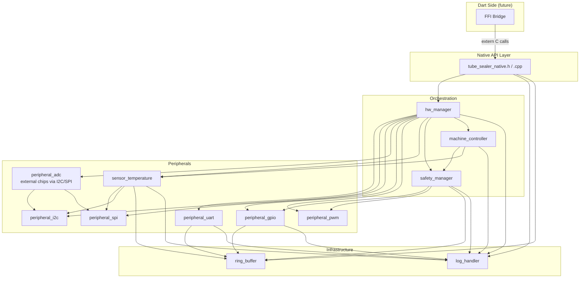
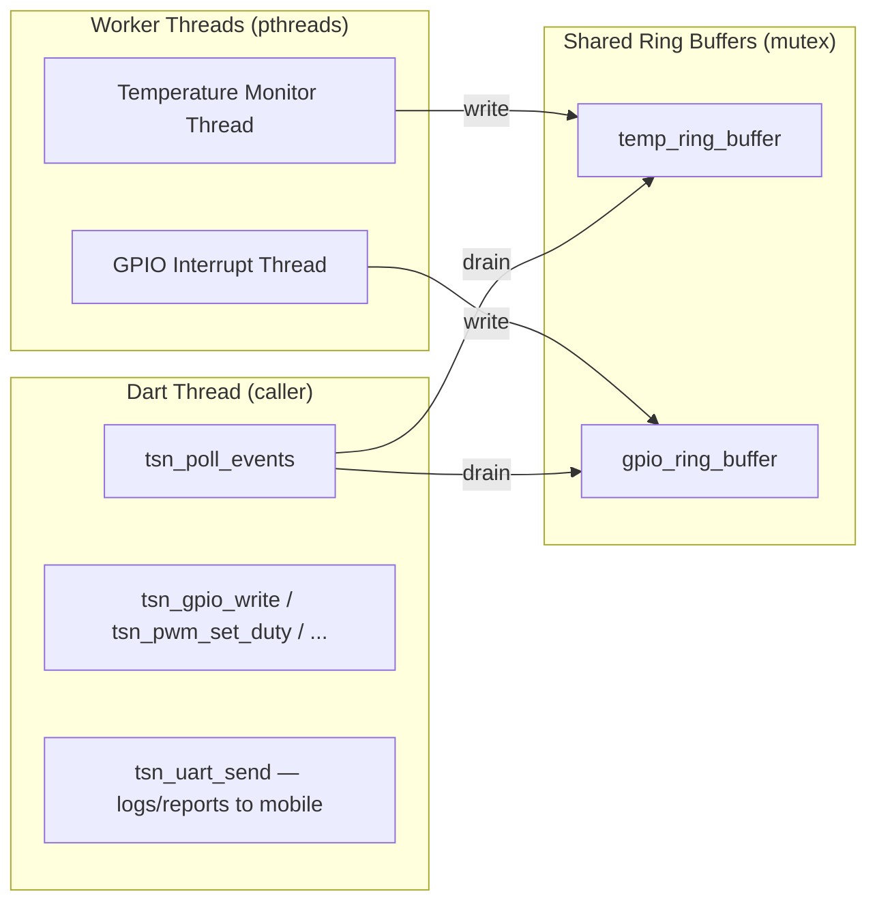

# Design Document: Native Hardware Plugin

## Overview

This design covers the native C/C++ implementation of the `tube_sealer_native` FFI plugin. The plugin lives in `packages/tube_sealer_native/` and exposes a flat C API that Dart calls via `dart:ffi`. All hardware I/O, threading, and safety logic runs in native code on a Linux ARM target. The plugin is created via `flutter create --template=plugin_ffi --platforms=linux,windows` and supports both platforms — Windows for development/testing (with mock hardware) and Linux for production deployment on RPi4B.

The native layer is structured as a collection of self-contained components, each built as a static library and linked into a single `.so`. The public FFI boundary is a pure C header (`tube_sealer_native.h`) — C++ is used internally for implementation convenience but never leaks across the FFI surface. The target platform is Raspberry Pi 4B (BCM2711, ARM Cortex-A72, Linux). Since the RPi4B has no built-in ADC, the `peripheral_adc` component is a higher-level abstraction that communicates with external ADC chips (ADS1115 over I2C, MCP3008 over SPI) through the existing I2C and SPI peripheral components.

Key design decisions:
- **`extern "C"` FFI boundary, C++ internals**: The public API uses `extern "C"` functions and plain C-ABI compatible structs (no constructors, no methods, no inheritance). Internally, components use full C++ (RAII, templates, classes). Dart FFI only understands C ABI, so the boundary must be C-compatible even though everything behind it is C++.
- **Opaque handle pattern**: Dart receives an opaque `TsnContext*` pointer. All API calls take this handle. The actual struct definition is hidden in the implementation.
- **Pull-based event model**: No callbacks cross the FFI boundary. Dart polls for events via `tsn_poll_events()`, which drains ring buffers into a contiguous `TsnEventBatch` memory region.
- **Per-component static libraries**: Each component under `src/components/` is a CMake static library target. The top-level CMake links them all into `libtube_sealer_native.so` (Linux) or `tube_sealer_native.dll` (Windows).
- **Three-layer component pattern**: Each peripheral component has a `*_linux.cpp` (Linux platform HAL), optionally a `*_windows.cpp` (Windows stub/mock), a `*_manager.cpp` (platform-agnostic logic), and `include/*.h` headers.
- **Dual platform support**: Created via `flutter create --template=plugin_ffi --platforms=linux,windows`. Windows build uses stubs/mocks for hardware peripherals, enabling development and testing without real hardware.

## Plugin Creation and Platform Structure

The plugin is scaffolded using the Flutter CLI:

```bash
cd packages
flutter create --template=plugin_ffi --platforms=linux,windows tube_sealer_native
```

This generates the standard FFI plugin layout:

```
packages/tube_sealer_native/
├── pubspec.yaml                    # Declares linux + windows FFI plugin
├── ffigen.yaml                     # dart:ffi binding generator config
│
├── lib/                            # Dart side
│   ├── tube_sealer_native.dart     # Public barrel file
│   └── src/
│       └── ...
│
├── linux/                          # Flutter Linux build integration
│   └── CMakeLists.txt              # Includes src/CMakeLists.txt
│
├── windows/                        # Flutter Windows build integration
│   └── CMakeLists.txt              # Includes src/CMakeLists.txt
│
└── src/                            # Shared native C/C++ code (both platforms)
    ├── CMakeLists.txt              # Top-level native build
    ├── tube_sealer_native.h
    ├── tube_sealer_native.cpp
    └── components/
        └── ...
```

The `linux/CMakeLists.txt` and `windows/CMakeLists.txt` both include the shared `src/CMakeLists.txt`. Platform-specific code is isolated in `*_linux.cpp` / `*_windows.cpp` files within each component, selected at compile time via CMake conditionals. On Windows, `std::thread` is used instead of pthreads, and peripheral platform layers are stubs/mocks for development testing.

The main app references the plugin in its `pubspec.yaml`:

```yaml
dependencies:
  tube_sealer_native:
    path: packages/tube_sealer_native
```

## Architecture



### Dependency Graph

```
ring_buffer, log_handler          ← foundation (no deps)
peripheral_uart/i2c/spi/gpio/pwm ← depend on ring_buffer + log_handler
peripheral_adc                    ← depends on peripheral_i2c, peripheral_spi (external ADC chips, no built-in ADC on RPi4B)
sensor_temperature                ← depends on peripheral_spi, peripheral_i2c
safety_manager                    ← depends on peripheral_gpio, peripheral_pwm, ring_buffer
machine_controller                ← depends on safety_manager, sensor_temperature
hw_manager                        ← depends on all components (orchestrator)
tube_sealer_native.cpp            ← depends on hw_manager (API surface)
```

### Thread Model



Three dedicated worker pthreads run continuously:
1. **Temperature monitor thread** — samples sensors at configurable interval, pushes readings + alerts
2. **GPIO interrupt thread** — monitors edge events via `poll()`/`epoll()` on gpiod file descriptors, pushes state changes

UART does not have a worker thread — it is TX-only, used for sending logs, reports, and machine details to a connected mobile device over serial.

All threads check a shared atomic stop flag each iteration and exit cleanly on shutdown.

## Components and Interfaces

### Public C API (`tube_sealer_native.h`)

The FFI boundary. All functions are `extern "C"`, all types are plain C structs or opaque pointers.

```c
// Opaque context handle
typedef struct TsnContext TsnContext;

// Status codes
typedef enum {
    TSN_OK = 0,
    TSN_ERR_INVALID_HANDLE = -1,
    TSN_ERR_ALREADY_INITIALIZED = -2,
    TSN_ERR_INIT_FAILED = -3,
    TSN_ERR_PERIPHERAL_FAULT = -4,
    TSN_ERR_SYSTEM_HALTED = -5,
    TSN_ERR_INVALID_STATE_TRANSITION = -6,
    TSN_ERR_INVALID_PARAM = -7,
    TSN_ERR_IO = -8,
    TSN_ERR_BUS = -9,
    TSN_ERR_NACK = -10,
    TSN_ERR_TIMEOUT = -11,
    TSN_ERR_PWM_UNAVAILABLE = -12,
    TSN_ERR_ADC_OUT_OF_RANGE = -13,
} TsnStatus;

// Initialization result
typedef struct {
    TsnStatus status;
    uint32_t  peripheral_bitmask;  // bit per peripheral: 1=ok, 0=failed
} TsnInitResult;

// Lifecycle
TsnInitResult tsn_init(const TsnConfig* config);
TsnStatus     tsn_shutdown(TsnContext* ctx);
TsnContext*    tsn_get_context(void);

// Event polling
TsnStatus     tsn_poll_events(TsnContext* ctx, TsnEventBatch* out_batch);

// UART
TsnStatus     tsn_uart_send(TsnContext* ctx, const uint8_t* data, uint32_t len, uint32_t* bytes_written);

// I2C
TsnStatus     tsn_i2c_read(TsnContext* ctx, uint8_t addr, uint8_t reg, uint8_t* buf, uint32_t len);
TsnStatus     tsn_i2c_write(TsnContext* ctx, uint8_t addr, uint8_t reg, const uint8_t* data, uint32_t len);

// SPI
TsnStatus     tsn_spi_transfer(TsnContext* ctx, const uint8_t* tx, uint8_t* rx, uint32_t len);

// ADC
TsnStatus     tsn_adc_read(TsnContext* ctx, uint8_t channel, TsnAdcReading* out);

// GPIO
TsnStatus     tsn_gpio_write(TsnContext* ctx, uint16_t pin, uint8_t value);
TsnStatus     tsn_gpio_read(TsnContext* ctx, uint16_t pin, uint8_t* out_value);

// PWM
TsnStatus     tsn_pwm_set_duty(TsnContext* ctx, uint8_t channel, float duty_cycle);
TsnStatus     tsn_pwm_set_freq(TsnContext* ctx, uint8_t channel, uint32_t freq_hz);
TsnStatus     tsn_pwm_disable(TsnContext* ctx, uint8_t channel);

// Machine controller
TsnStatus     tsn_mc_transition(TsnContext* ctx, TsnMachineState target_state);
TsnStatus     tsn_mc_get_state(TsnContext* ctx, TsnMachineState* out_state);

// Safety
TsnStatus     tsn_safety_refresh_watchdog(TsnContext* ctx);
TsnStatus     tsn_safety_get_status(TsnContext* ctx, TsnSafetyStatus* out);

// Logging
TsnStatus     tsn_set_log_level(TsnContext* ctx, TsnLogLevel level);
```

### Ring Buffer (`ring_buffer`)

A generic, mutex-protected circular buffer templated on entry type.

```cpp
// include/ring_buffer.h
template<typename T, size_t Capacity>
class RingBuffer {
public:
    bool push(const T& entry);       // returns false if full (overwrites oldest)
    bool pop(T* out);                // returns false if empty
    size_t drain(T* out, size_t max); // drain up to max entries, returns count
    size_t count() const;
    uint64_t dropped_count() const;
    uint64_t next_sequence() const;
private:
    T buffer_[Capacity];
    size_t head_ = 0;
    size_t tail_ = 0;
    size_t size_ = 0;
    uint64_t seq_ = 0;
    uint64_t dropped_ = 0;
    mutable pthread_mutex_t mutex_;
};
```

Design notes:
- `push()` on a full buffer overwrites the oldest entry and increments `dropped_`.
- Every pushed entry gets a monotonically increasing sequence number (`seq_`).
- `drain()` is the primary consumer path — used by `tsn_poll_events()` to batch-read.
- Mutex is a `pthread_mutex_t` (not `std::mutex`) for predictable behavior on embedded Linux.

### Log Handler (`log_handler`)

```cpp
// include/log_handler.h
typedef enum { TSN_LOG_ERROR, TSN_LOG_WARN, TSN_LOG_INFO, TSN_LOG_DEBUG } TsnLogLevel;

typedef enum { TSN_LOG_OUTPUT_STDERR, TSN_LOG_OUTPUT_FILE, TSN_LOG_OUTPUT_RINGBUF, TSN_LOG_OUTPUT_UART } TsnLogOutput;

void tsn_log_init(TsnLogLevel min_level, TsnLogOutput output, const char* file_path);
void tsn_log(TsnLogLevel level, const char* component, const char* fmt, ...);
void tsn_log_shutdown(void);
```

Design notes:
- Thread-safe via internal mutex. Callable from any thread.
- `tsn_log()` is a variadic C function — keeps the FFI boundary clean.
- Timestamps use `clock_gettime(CLOCK_MONOTONIC)` for consistent ordering.
- When output is `TSN_LOG_OUTPUT_RINGBUF`, log entries are pushed to a ring buffer that Dart can drain.
- When output is `TSN_LOG_OUTPUT_UART`, log entries are transmitted over UART serial to the connected mobile device via the UartManager.

### Peripheral Components (Three-Layer Pattern)

Each peripheral follows the same structure. Using `peripheral_uart` as the example:

```
peripheral_uart/
├── CMakeLists.txt
├── include/
│   ├── uart_platform.h      # Platform interface (abstract)
│   ├── uart_manager.h       # Public API for this component
│   └── uart_types.h         # Shared types (config, status)
├── uart_linux.cpp            # Linux implementation of uart_platform.h
└── uart_manager.cpp          # Platform-agnostic logic
```

**Platform interface** (`uart_platform.h`):
```cpp
struct UartPlatform {
    int  (*open)(const UartConfig* cfg);
    int  (*read)(int fd, uint8_t* buf, size_t len);
    int  (*write)(int fd, const uint8_t* buf, size_t len);
    void (*close)(int fd);
};
```

**Manager** (`uart_manager.h`):
```cpp
class UartManager {
public:
    TsnStatus init(const UartConfig& cfg, const UartPlatform& platform);
    TsnStatus send(const uint8_t* data, uint32_t len, uint32_t* written);
    TsnStatus send_log(const char* log_entry);      // convenience for log output
    TsnStatus send_report(const uint8_t* data, uint32_t len); // machine reports
    void      stop();
    bool      has_fault() const;
private:
    UartPlatform platform_;
    int fd_ = -1;
    std::atomic<bool> fault_flag_{false};
    pthread_mutex_t tx_mutex_;  // serialize TX writes from multiple callers
};
```

UART is TX-only — used for sending logs, machine reports, and tube sealer details to a connected mobile device over serial. No RX worker thread is needed.

This pattern repeats for I2C, SPI, GPIO, and PWM — each with their own platform interface, manager, and types. The ADC component is slightly different: instead of a `*_linux.cpp` platform layer, it has chip-specific drivers (`adc_ads1115.cpp`, `adc_mcp3008.cpp`) that communicate through the I2C or SPI peripheral managers, since the RPi4B has no built-in ADC.

### Hardware Manager (`hw_manager`)

Owns the `TsnContext` struct and orchestrates all component lifecycles.

```cpp
struct TsnContext {
    // Peripherals
    UartManager   uart;
    I2cManager    i2c;
    SpiManager    spi;
    AdcManager    adc;
    GpioManager   gpio;
    PwmManager    pwm;

    // Higher-level
    TempMonitor       temp_monitor;
    SafetyManager     safety;
    MachineController machine_ctrl;

    // Shared ring buffers (no UART ring — UART is TX-only for logs/reports)
    RingBuffer<TsnEvent, 256> temp_ring;
    RingBuffer<TsnEvent, 256> gpio_ring;

    // State
    std::atomic<bool> initialized{false};
    uint32_t peripheral_bitmask = 0;
};
```

### Safety Manager (`safety_manager`)

```cpp
class SafetyManager {
public:
    TsnStatus init(GpioManager& gpio, PwmManager& pwm, RingBuffer<TsnEvent, 256>& ring);
    void      check_overtemp(float temp, uint8_t sensor_id, uint64_t timestamp);
    void      check_estop();
    void      refresh_watchdog();
    bool      is_halted() const;
    TsnSafetyStatus get_status() const;
private:
    GpioManager* gpio_;
    PwmManager* pwm_;
    RingBuffer<TsnEvent, 256>* ring_;
    std::atomic<bool> halted_{false};
    uint64_t watchdog_deadline_ = 0;
    uint64_t overtemp_start_[MAX_SENSORS] = {};
    uint64_t overtemp_timeout_ms_ = 0;
};
```

### Machine Controller (`machine_controller`)

```cpp
enum class TsnMachineState : uint8_t {
    IDLE, PREHEAT, SEAL, COOL_DOWN, COMPLETE, FAULT
};

class MachineController {
public:
    TsnStatus init(SafetyManager& safety, TempMonitor& temp);
    TsnStatus transition(TsnMachineState target);
    TsnMachineState current_state() const;
private:
    TsnMachineState state_ = TsnMachineState::IDLE;
    SafetyManager* safety_;
    TempMonitor* temp_;
    bool is_valid_transition(TsnMachineState from, TsnMachineState to) const;
};
```

Valid state transitions:
```
IDLE → PREHEAT
PREHEAT → SEAL, FAULT
SEAL → COOL_DOWN, FAULT
COOL_DOWN → COMPLETE, FAULT
COMPLETE → IDLE
FAULT → IDLE (after reset)
```

### Sensor Temperature (`sensor_temperature`)

```cpp
class TempMonitor {
public:
    TsnStatus init(SpiManager& spi, I2cManager& i2c, const TempConfig& cfg);
    void start_thread(RingBuffer<TsnEvent, 256>& ring);
    void stop();
    float last_reading(uint8_t sensor_id) const;
private:
    SpiManager* spi_;
    I2cManager* i2c_;
    TempConfig cfg_;
    pthread_t thread_;
    std::atomic<bool> stop_flag_{false};
    float last_readings_[MAX_SENSORS] = {};
};
```

## Data Models

### Event Types and Serialization

All events crossing the FFI boundary share a common tagged layout:

```c
typedef enum {
    TSN_EVENT_TEMP_READING = 1,
    TSN_EVENT_TEMP_ALERT = 2,
    TSN_EVENT_GPIO_CHANGE = 3,
    TSN_EVENT_SENSOR_FAULT = 4,
    TSN_EVENT_SAFETY_EMERGENCY = 5,
    TSN_EVENT_LOG = 6,
} TsnEventType;

typedef struct {
    uint8_t  type;        // TsnEventType
    uint64_t sequence;    // monotonic sequence number
    uint64_t timestamp;   // nanoseconds from CLOCK_MONOTONIC
    union {
        struct { uint8_t sensor_id; float temp_c; float threshold; } temp;
        struct { uint16_t pin; uint8_t value; uint8_t edge; } gpio;
        struct { uint8_t sensor_id; uint8_t fault_code; } sensor_fault;
        struct { uint8_t reason; } safety;
        struct { uint8_t level; char component[16]; char msg[128]; } log;
    } payload;
} TsnEvent;
```

### Event Batch

```c
#define TSN_MAX_BATCH_EVENTS 128

typedef struct {
    uint32_t total_count;
    uint32_t temp_count;
    uint32_t gpio_count;
    uint32_t other_count;
    uint64_t dropped_total;    // sum of dropped counts across all ring buffers
    TsnEvent events[TSN_MAX_BATCH_EVENTS];
} TsnEventBatch;
```

The batch is a flat, contiguous struct. Dart reads it directly via FFI pointer access — no additional native calls needed.

### Configuration Structs

```c
typedef struct {
    char     device_path[64];
    uint32_t baud_rate;
    uint8_t  data_bits;    // 5-8
    uint8_t  stop_bits;    // 1-2
    uint8_t  parity;       // 0=none, 1=odd, 2=even
    uint8_t  flow_control; // 0=none, 1=hw, 2=sw
} TsnUartConfig;

typedef struct {
    uint8_t bus_number;
    uint8_t device_address;
} TsnI2cConfig;

typedef struct {
    uint8_t  bus_number;
    uint8_t  chip_select;
    uint32_t clock_hz;
    uint8_t  mode;  // 0-3
} TsnSpiConfig;

typedef struct {
    uint8_t chip_type;     // 0=ADS1115 (I2C), 1=MCP3008 (SPI)
    uint8_t channel;
    // I2C config (used when chip_type=0)
    uint8_t i2c_bus;
    uint8_t i2c_address;
    // SPI config (used when chip_type=1)
    uint8_t spi_bus;
    uint8_t spi_cs;
    uint32_t spi_clock_hz;
} TsnAdcConfig;

typedef struct {
    uint16_t pin;
    uint8_t  direction;  // 0=input, 1=output
    uint8_t  edge;       // 0=none, 1=rising, 2=falling, 3=both
} TsnGpioPin;

typedef struct {
    uint8_t  chip;
    uint8_t  channel;
    uint32_t frequency_hz;
    float    duty_cycle;  // 0.0 - 1.0
} TsnPwmConfig;

typedef struct {
    float    high_threshold_c;
    float    low_threshold_c;
    uint32_t sample_interval_ms;
    uint32_t overtemp_timeout_ms;
} TsnTempConfig;

typedef struct {
    uint16_t estop_pin;
    uint32_t watchdog_timeout_ms;
} TsnSafetyConfig;

typedef struct {
    TsnUartConfig   uart;
    TsnI2cConfig    i2c;
    TsnSpiConfig    spi;
    TsnAdcConfig    adc;
    TsnGpioPin      gpio_pins[32];
    uint8_t         gpio_pin_count;
    TsnPwmConfig    pwm[8];
    uint8_t         pwm_count;
    TsnTempConfig   temp;
    TsnSafetyConfig safety;
    TsnLogLevel     log_level;
    TsnLogOutput    log_output;
    char            log_file_path[128];
} TsnConfig;

typedef struct {
    float   temp_c;
    int32_t raw_value;
    float   scale_factor;
} TsnAdcReading;

typedef struct {
    bool    halted;
    bool    overtemp;
    bool    estop_active;
    bool    watchdog_expired;
    uint8_t fault_count;
} TsnSafetyStatus;
```

### State Machine Transitions Table

| From | To | Condition |
|---|---|---|
| IDLE | PREHEAT | Explicit command |
| PREHEAT | SEAL | Temperature reached target |
| PREHEAT | FAULT | Safety fault detected |
| SEAL | COOL_DOWN | Seal criteria met (temp + pressure + time) |
| SEAL | FAULT | Safety fault detected |
| COOL_DOWN | COMPLETE | Cool-down period elapsed |
| COOL_DOWN | FAULT | Safety fault detected |
| COMPLETE | IDLE | Explicit command (reset) |
| FAULT | IDLE | Explicit command (after fault cleared) |


## Correctness Properties

*A property is a characteristic or behavior that should hold true across all valid executions of a system — essentially, a formal statement about what the system should do. Properties serve as the bridge between human-readable specifications and machine-verifiable correctness guarantees.*

### Property 1: Initialization returns valid handle and status

*For any* valid `TsnConfig`, calling `tsn_init()` should return `TSN_OK` status and a non-null context handle retrievable via `tsn_get_context()`.

**Validates: Requirements 1.1, 1.2**

### Property 2: Partial initialization bitmask accuracy

*For any* subset of peripherals that fail during initialization (simulated via mock platform layers), the returned `peripheral_bitmask` should have bit N set to 1 if and only if peripheral N initialized successfully, and the overall status should indicate partial initialization.

**Validates: Requirements 1.3**

### Property 3: Shutdown deallocates all resources

*For any* successfully initialized `TsnContext`, calling `tsn_shutdown()` should return `TSN_OK`, all worker threads should have exited (joined), and `tsn_get_context()` should return null afterward.

**Validates: Requirements 1.4**

### Property 4: Peripheral initialization with valid config

*For any* peripheral type (UART, I2C, SPI, ADC, GPIO, PWM) and any valid configuration for that peripheral, calling the peripheral's init function with a mock platform layer should return `TSN_OK`.

**Validates: Requirements 3.1, 3.5, 4.1, 5.1, 6.1, 7.1, 8.1**

### Property 5: UART TX log/report passthrough

*For any* byte buffer passed to `tsn_uart_send()`, the mock platform write function should receive the identical byte buffer, and the returned bytes-written count should match the platform's return value. This validates that logs, reports, and machine details are transmitted correctly over serial.

**Validates: Requirements 4.2, 4.3**

### Property 7: I2C write-then-read round trip

*For any* valid I2C device address, register address, and data bytes, writing the data via `tsn_i2c_write()` and then reading from the same register via `tsn_i2c_read()` through a mock platform that stores written data should return the same bytes.

**Validates: Requirements 4.2, 4.3**

### Property 8: SPI full-duplex transfer integrity

*For any* transmit byte buffer, calling `tsn_spi_transfer()` should pass the exact TX buffer to the mock platform and return the mock platform's RX buffer unmodified to the caller.

**Validates: Requirements 5.2**

### Property 9: ADC read returns raw value and scale via external chip

*For any* ADC chip type (ADS1115 or MCP3008), channel, and mock raw reading value returned by the underlying I2C or SPI transaction, calling `tsn_adc_read()` should return a `TsnAdcReading` whose `raw_value` matches the mock's return and whose `scale_factor` is the configured scale for that chip/channel combination.

**Validates: Requirements 6.2**

### Property 10: GPIO write-then-read round trip

*For any* GPIO pin configured as output and any logic level (0 or 1), writing the level via `tsn_gpio_write()` and then reading via `tsn_gpio_read()` through a mock platform that reflects writes should return the same logic level.

**Validates: Requirements 7.2, 7.3**

### Property 11: GPIO edge events flow to ring buffer with correct edge type

*For any* GPIO pin configured with an edge detection type (rising, falling, both) and any sequence of mock edge events, the GPIO worker thread should push events into the GPIO ring buffer where each event's edge field matches the configured detection type and the pin/value fields match the mock input.

**Validates: Requirements 7.4, 7.5**

### Property 12: PWM parameter updates are applied

*For any* valid duty cycle value (0.0–1.0) and any valid frequency value, calling `tsn_pwm_set_duty()` or `tsn_pwm_set_freq()` should result in the mock platform receiving the exact requested value.

**Validates: Requirements 8.2, 8.3**

### Property 13: Ring buffer overflow invariant

*For any* sequence of N pushes to a ring buffer of capacity C where N > C, the dropped count should equal N − C, the buffer should contain the most recent C entries, and all entries should have strictly monotonically increasing sequence numbers.

**Validates: Requirements 9.4, 9.5**

### Property 14: Ring buffer concurrent access integrity

*For any* interleaving of push and drain operations from multiple threads on the same ring buffer, no entry should be corrupted (all fields should match what was pushed), and the total of drained entries plus remaining entries plus dropped count should equal the total pushed count.

**Validates: Requirements 9.2**

### Property 15: Worker thread clean shutdown

*For any* worker thread type (UART RX, temperature, GPIO), setting the stop flag and then joining the thread should complete within a bounded time, and the thread should not access shared resources after observing the stop flag.

**Validates: Requirements 9.3**

### Property 16: Poll events drains all ring buffers into correct batch

*For any* combination of events pushed into the temperature and GPIO ring buffers, calling `tsn_poll_events()` should return an `TsnEventBatch` where `total_count` equals the sum of events across all buffers, per-type counts match the actual events of each type, and every event in the batch array has a valid type tag and timestamp.

**Validates: Requirements 10.1, 10.2**

### Property 17: Temperature threshold alerts

*For any* temperature reading and configured high/low thresholds, if the reading exceeds the high threshold, an over-temperature alert event should be pushed to the ring buffer; if the reading falls below the low threshold, an under-temperature alert event should be pushed; if the reading is within thresholds, no alert event should be pushed.

**Validates: Requirements 11.1, 11.2, 11.3**

### Property 18: Safety manager over-temperature timeout shutdown

*For any* over-temperature condition that persists for longer than the configured timeout, the safety manager should disable the associated PWM output and push an emergency-shutdown event into the ring buffer. If the condition resolves before the timeout, no shutdown should occur.

**Validates: Requirements 12.2**

### Property 19: Emergency stop halts all outputs

*For any* system state, when an emergency stop signal is detected on the configured GPIO pin, the safety manager should disable all actuator outputs and set the system-halted flag to true.

**Validates: Requirements 12.3**

### Property 20: Halted system rejects actuator commands

*For any* actuator command (PWM set duty, PWM set freq, GPIO write, UART send) issued while the system-halted flag is set, the Native_API_Layer should return `TSN_ERR_SYSTEM_HALTED` without performing the operation.

**Validates: Requirements 12.4**

### Property 21: Watchdog expiry triggers safe shutdown

*For any* watchdog timeout value, if `tsn_safety_refresh_watchdog()` is not called within the timeout period, the safety manager should disable all actuator outputs.

**Validates: Requirements 12.5**

### Property 22: State machine transition validity

*For any* pair of (current_state, target_state) from the set {IDLE, PREHEAT, SEAL, COOL_DOWN, COMPLETE, FAULT}, calling `tsn_mc_transition(target_state)` should succeed if and only if the pair is in the valid transitions table, and should return `TSN_ERR_INVALID_STATE_TRANSITION` otherwise.

**Validates: Requirements 13.2, 13.3**

### Property 23: Fault during active state transitions to FAULT

*For any* active machine state (PREHEAT, SEAL, COOL_DOWN), if a fault condition is signaled, the machine controller should transition to the FAULT state and command the safety manager to disable actuator outputs.

**Validates: Requirements 13.5**

### Property 24: Log message format invariant

*For any* log level, component name, and message string, the formatted log output should contain a timestamp, the log level string, the component name, and the message string.

**Validates: Requirements 14.2**

### Property 25: Log level filtering

*For any* configured minimum log level and any log message with a given severity, the message should appear in the output if and only if its severity is greater than or equal to the configured minimum level.

**Validates: Requirements 14.4**

### Property 26: Log handler thread safety

*For any* interleaving of log calls from multiple threads, no log entry should be corrupted or interleaved with another entry, and no deadlock should occur.

**Validates: Requirements 14.5**

### Property 27: Event serialization round trip

*For any* valid hardware event (temperature reading, GPIO event, sensor fault, safety emergency), serializing the event into the `TsnEvent` binary struct layout and then reading the fields back should produce values equivalent to the original event fields.

**Validates: Requirements 16.1, 16.2, 16.3**

## Error Handling

### Error Code Strategy

All native functions return `TsnStatus` enum values. Negative values indicate errors, zero indicates success. The error codes are designed to be specific enough for the Dart layer to take appropriate action:

| Error Code | Meaning | Recovery |
|---|---|---|
| `TSN_OK` | Success | N/A |
| `TSN_ERR_INVALID_HANDLE` | Null or invalid context | Re-initialize |
| `TSN_ERR_ALREADY_INITIALIZED` | Double init attempt | Use existing context |
| `TSN_ERR_INIT_FAILED` | Complete init failure | Check config, retry |
| `TSN_ERR_PERIPHERAL_FAULT` | Peripheral I/O error | Check hardware, re-init peripheral |
| `TSN_ERR_SYSTEM_HALTED` | Safety halt active | Clear fault, reset |
| `TSN_ERR_INVALID_STATE_TRANSITION` | Disallowed state change | Check current state |
| `TSN_ERR_INVALID_PARAM` | Bad parameter value | Fix caller input |
| `TSN_ERR_IO` | File/device I/O error | Retry or re-init |
| `TSN_ERR_BUS` | I2C/SPI bus error | Check wiring, retry |
| `TSN_ERR_NACK` | I2C NACK received | Check device address |
| `TSN_ERR_TIMEOUT` | Operation timed out | Retry |
| `TSN_ERR_PWM_UNAVAILABLE` | PWM channel not exported | Check sysfs config |
| `TSN_ERR_ADC_OUT_OF_RANGE` | ADC reading invalid | Use last valid reading |

### Fault Propagation

1. **Peripheral faults** — Each peripheral manager sets an atomic `fault_flag_`. The hw_manager checks these flags and reports them via the event batch.
2. **Safety faults** — The safety manager can halt the entire system. Once halted, all actuator commands are rejected until explicit reset.
3. **Thread faults** — If a worker thread encounters an unrecoverable error, it pushes a fault event to its ring buffer and exits. The hw_manager detects the thread exit on the next poll cycle.

### Resource Cleanup Guarantees

- `tsn_shutdown()` always attempts to join all threads (with a timeout) before closing file descriptors.
- File descriptors are closed in reverse order of opening.
- Ring buffers are drained and freed after threads are joined.
- If a thread doesn't respond to the stop flag within 2 seconds, it is detached (not killed) and the shutdown continues.

## Testing Strategy

### Testing Framework

- **Unit tests**: Google Test (gtest) for C++ unit tests
- **Property-based tests**: [RapidCheck](https://github.com/emil-e/rapidcheck) — a C++ property-based testing library compatible with Google Test
- **Mocking**: Custom mock platform layers (not gmock) — each peripheral's platform interface is a struct of function pointers, making it trivial to substitute mock implementations

### Test Structure

```
packages/tube_sealer_native/
└── test/
    ├── CMakeLists.txt
    ├── mocks/
    │   ├── mock_uart_platform.h
    │   ├── mock_i2c_platform.h
    │   ├── mock_spi_platform.h
    │   ├── mock_adc_platform.h
    │   ├── mock_gpio_platform.h
    │   └── mock_pwm_platform.h
    ├── unit/
    │   ├── test_ring_buffer.cpp
    │   ├── test_log_handler.cpp
    │   ├── test_uart_manager.cpp
    │   ├── test_i2c_manager.cpp
    │   ├── test_spi_manager.cpp
    │   ├── test_adc_manager.cpp
    │   ├── test_gpio_manager.cpp
    │   ├── test_pwm_manager.cpp
    │   ├── test_safety_manager.cpp
    │   ├── test_machine_controller.cpp
    │   ├── test_hw_manager.cpp
    │   └── test_event_batch.cpp
    └── property/
        ├── prop_ring_buffer.cpp
        ├── prop_peripheral_init.cpp
        ├── prop_uart_data_flow.cpp
        ├── prop_gpio_roundtrip.cpp
        ├── prop_i2c_roundtrip.cpp
        ├── prop_spi_transfer.cpp
        ├── prop_event_batch.cpp
        ├── prop_event_serialization.cpp
        ├── prop_temp_alerts.cpp
        ├── prop_safety_manager.cpp
        ├── prop_machine_controller.cpp
        └── prop_log_handler.cpp
```

### Unit Test Focus

Unit tests cover specific examples, edge cases, and error conditions:
- Null/invalid handle rejection (Req 1.5)
- Double initialization rejection (Req 1.6)
- UART device open failure sets fault flag (Req 3.4)
- I2C NACK returns correct error code (Req 4.4)
- SPI transfer failure returns error (Req 5.3)
- ADC out-of-range returns last valid reading (Req 6.3)
- PWM unavailable channel returns error (Req 8.5)
- PWM disable sets duty to zero (Req 8.4)
- Empty poll returns zero-count batch (Req 10.3)
- Temperature sensor fault pushes fault event (Req 11.4)
- Multiple simultaneous faults prioritize e-stop (Req 12.6)
- All six machine states exist (Req 13.1)
- Log levels exist: error, warning, info, debug (Req 14.1)
- Log output to stderr, file, and ring buffer (Req 14.3)
- Unrecognized event type tag is skipped during deserialization (Req 16.4)

### Property-Based Test Focus

Each property test uses RapidCheck with a minimum of 100 iterations. Each test is tagged with its design property reference.

```cpp
// Example: Property 13 — Ring buffer overflow invariant
// Feature: native-hardware-plugin, Property 13: Ring buffer overflow invariant
RC_GTEST_PROP(RingBuffer, OverflowInvariant, (std::vector<TsnEvent> events)) {
    constexpr size_t CAP = 64;
    RingBuffer<TsnEvent, CAP> rb;
    for (const auto& e : events) { rb.push(e); }
    size_t n = events.size();
    if (n > CAP) {
        RC_ASSERT(rb.dropped_count() == n - CAP);
    }
    RC_ASSERT(rb.count() <= CAP);
    // drain and verify sequence numbers are monotonically increasing
    TsnEvent buf[CAP];
    size_t drained = rb.drain(buf, CAP);
    for (size_t i = 1; i < drained; i++) {
        RC_ASSERT(buf[i].sequence > buf[i-1].sequence);
    }
}
```

### Property-to-Test Mapping

| Property | Test File | Tag |
|---|---|---|
| 1: Init returns valid handle | prop_peripheral_init.cpp | Feature: native-hardware-plugin, Property 1 |
| 2: Partial init bitmask | prop_peripheral_init.cpp | Feature: native-hardware-plugin, Property 2 |
| 3: Shutdown deallocates | prop_peripheral_init.cpp | Feature: native-hardware-plugin, Property 3 |
| 4: Peripheral init with valid config | prop_peripheral_init.cpp | Feature: native-hardware-plugin, Property 4 |
| 5: UART RX to ring buffer | prop_uart_data_flow.cpp | Feature: native-hardware-plugin, Property 5 |
| 6: UART TX passthrough | prop_uart_data_flow.cpp | Feature: native-hardware-plugin, Property 6 |
| 7: I2C write-read round trip | prop_i2c_roundtrip.cpp | Feature: native-hardware-plugin, Property 7 |
| 8: SPI transfer integrity | prop_spi_transfer.cpp | Feature: native-hardware-plugin, Property 8 |
| 9: ADC read returns raw + scale | prop_peripheral_init.cpp | Feature: native-hardware-plugin, Property 9 |
| 10: GPIO write-read round trip | prop_gpio_roundtrip.cpp | Feature: native-hardware-plugin, Property 10 |
| 11: GPIO edge events to ring buffer | prop_gpio_roundtrip.cpp | Feature: native-hardware-plugin, Property 11 |
| 12: PWM parameter updates | prop_peripheral_init.cpp | Feature: native-hardware-plugin, Property 12 |
| 13: Ring buffer overflow invariant | prop_ring_buffer.cpp | Feature: native-hardware-plugin, Property 13 |
| 14: Ring buffer concurrent access | prop_ring_buffer.cpp | Feature: native-hardware-plugin, Property 14 |
| 15: Worker thread clean shutdown | prop_peripheral_init.cpp | Feature: native-hardware-plugin, Property 15 |
| 16: Poll events batch correctness | prop_event_batch.cpp | Feature: native-hardware-plugin, Property 16 |
| 17: Temperature threshold alerts | prop_temp_alerts.cpp | Feature: native-hardware-plugin, Property 17 |
| 18: Over-temp timeout shutdown | prop_safety_manager.cpp | Feature: native-hardware-plugin, Property 18 |
| 19: E-stop halts all outputs | prop_safety_manager.cpp | Feature: native-hardware-plugin, Property 19 |
| 20: Halted rejects actuator commands | prop_safety_manager.cpp | Feature: native-hardware-plugin, Property 20 |
| 21: Watchdog expiry shutdown | prop_safety_manager.cpp | Feature: native-hardware-plugin, Property 21 |
| 22: State transition validity | prop_machine_controller.cpp | Feature: native-hardware-plugin, Property 22 |
| 23: Fault transitions to FAULT | prop_machine_controller.cpp | Feature: native-hardware-plugin, Property 23 |
| 24: Log message format | prop_log_handler.cpp | Feature: native-hardware-plugin, Property 24 |
| 25: Log level filtering | prop_log_handler.cpp | Feature: native-hardware-plugin, Property 25 |
| 26: Log handler thread safety | prop_log_handler.cpp | Feature: native-hardware-plugin, Property 26 |
| 27: Event serialization round trip | prop_event_serialization.cpp | Feature: native-hardware-plugin, Property 27 |

### Build and Run

Tests are built via CMake alongside the main library:

```bash
# Host build (for development/testing with mocks)
mkdir build && cd build
cmake .. -DTSN_BUILD_TESTS=ON
make -j$(nproc)
ctest --output-on-failure

# Cross-compile for ARM (no tests)
mkdir build-arm && cd build-arm
cmake .. -DCMAKE_TOOLCHAIN_FILE=../cmake/arm-linux-gnueabihf.cmake
make -j$(nproc)
```

RapidCheck is fetched via CMake `FetchContent` or as a git submodule under `test/third_party/rapidcheck`.
